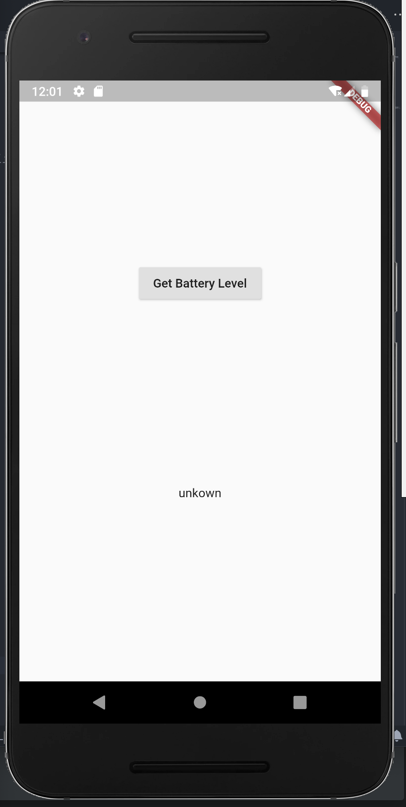

## platform channels를 이용하여 배터리 상태 가져오기 예제

[Platform integration 예제](https://flutter.dev/docs/development/platform-integration/platform-channels) 를 따라함.

---
### Goal(?)
- client 와 host에서 platform channels 사용해보기.


### 과정
1. 프로젝트 생성
2. flutter platform 구현.
- channel 생성 (MethodChannel 사용)
``` dart
class _MyHomePageState extends State<MyHomePage> {
  //host의 MethodChannel명과 일치해야함.
  //channel parameter는 '패키지/고유키'로 작성
static const platform = const MethodChannel('com.example.batterylevel/battery');    
  
  //Get battery level.

```

3. android platform 구현.

```java
public class MainActivity extends FlutterActivity {

  private static final String CHANNEL = "com.example.batterylevel/battery";     //flutter client의 채널명과 동일하게 설정

  @Override
  protected void onCreate(Bundle savedInstanceState) {
    System.out.println("log");
    super.onCreate(savedInstanceState);
    GeneratedPluginRegistrant.registerWith(this);

    new MethodChannel(getFlutterView(), CHANNEL).setMethodCallHandler(
            new MethodCallHandler() {
              @Override
              public void onMethodCall(MethodCall call, Result result) {
                if (call.method.equals("getBatteryLevel")) {
                  int batteryLevel = getBatteryLevel();

                  if (batteryLevel != -1) {
                    result.success(batteryLevel);
                  } else {
                    result.error("UNAVAILABLE", "Battery level not work", null);
                  }
                } else {
                  result.notImplemented();
                }
              } //onMethodCall()

            });
  } //onCreate()
```

## 구현 화면




##TIL

- flutter 앱 구동시, android, ios 부분 수정사항을 적용하기 위해선 정지(ㅁ) 후 재시작 할것. (완전종료 하지 않으면 hot reload... 😡) 
- MethodChannel() 사용하여 flutter, android 부분 연결 -> 플러그인 만들 때 잘 사용할 것 같으니 많이 연습할 것.
- 기타. Widget 생성 및 사용 등.